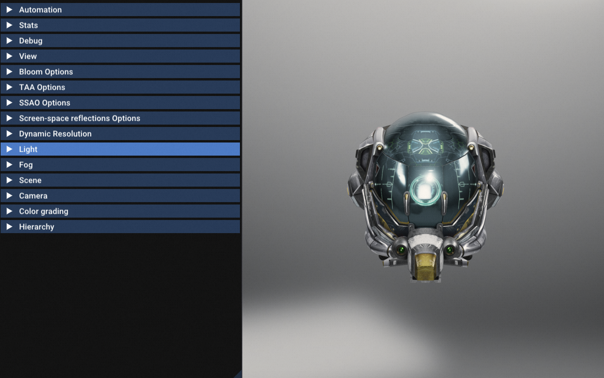

# July.8 2024
Works:</br>
1.clone并编译Filament </br>
2.总结编译系统与工具的区别 </br>

# July.10 2024

### task1 编译尝试Filament
Filament构建 MacOS 直接在根文件夹下执行该命令就会启动编译
  ```sh
  ./build.sh debug
  ```
默认用ninja，没有ninja就用make，MacbookPro M2芯片大概10-25min。

  ```sh
  FILAMENT_ENABLE_LTO: Enable link-time optimizations if supported by the compiler
  FILAMENT_BUILD_FILAMAT: Build filamat and JNI buildings
  FILAMENT_SUPPORTS_OPENGL: Include the OpenGL backend
  FILAMENT_SUPPORTS_METAL: Include the Metal backend
  FILAMENT_SUPPORTS_VULKAN: Include the Vulkan backend
  FILAMENT_INSTALL_BACKEND_TEST: Install the backend test library so it can be consumed on iOS
  FILAMENT_USE_EXTERNAL_GLES3: Experimental: Compile Filament against OpenGL ES 3
  FILAMENT_SKIP_SAMPLES: Don't build sample apps
  ```
在Cmake里可以指定 使用哪个API 如Vulkan和Metal

windows内的环境搭建，可以参考这一篇 </br>
https://www.cnblogs.com/zhyan8/p/18024342

编译完成后 所有的Sample都在: </br>
[out/cmake-debug/smaples]内


### task2 ninja环境
 ```sh
  brew install ninja  
  ninja --version
  ```

### task3 运行Filament测试
gltfviwer效果
  
helloPBR效果
  

# July.21 2024
工作：
1. 完成Anne Engine框架搭建
2. 增加整个项目和Engine内的CMakeLists
3. 增加3Party的文件

收获：
1. 工作流程，在vscode开发，需要打断点的时候再到VisualStudio内去调试
2. CMakeLists文件 博大精深，可以定义自己的静态库，也可以link其他的静态库，include third里的头文件。这样就不需要自己再到Visual Studio内去重新link。
3. 第三方库，分成需要Header-only的，和需要link的两种。前者只需要include它的hpp，后者则需要添加进CMakeLists.txt，去执行Build。


# July.22 2024
工作:
1. 增加单例模式 Singleton的hpp文件


# July.23 2024
工作：
1. 增加Application UI的空实现。
2. 增加EditorProject的CMakeLists。
3. 学习CMakeLists文件里的，可执行文件，Library，依赖关系。以及依赖关系中的继承关系。

收获：
1. 详见 Note3的 markdown。
2. 一个可执行文件的CmakeLists，是有很好的设计模式架构的。 一个可执行文件，多个Library。 然后他们需要在CmakeLists内添加依赖关系。约定谁先被编译，谁依赖谁。
3. 在CmakeList内定义的依赖关系 也是有类似的private public interface关系，可以管理依赖的传递。