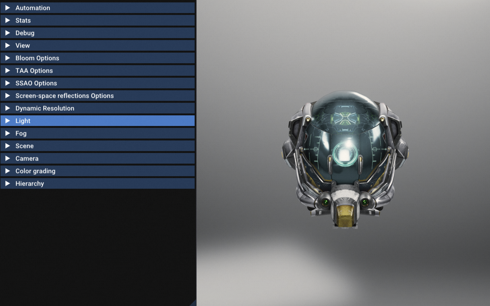

# July.8 2024
Works:</br>
1.clone并编译Filament </br>
2.总结编译系统与工具的区别 </br>

## Introduce
CMake、Clang、Make 和 Ninja, VisualStudio 和 Xcode之间的区别:

[编译器] Clang </br>
[构建系统生成器] CMake </br>
[构建系统] make, Ninja </br>
[集成开发环境IDE] VisualStuido, Xcode </br>

## 编译器

#### Clang

- **类型**：编译器
- **功能**：Clang 是一个用来编译 C、C++ 和 Objective-C 代码的编译器。它是 LLVM 项目的一部分，以其高性能和良好的诊断消息（警告和错误信息）而著称。
- **用法**：直接用作编译器，或作为其他构建系统的一部分来调用。
- **举例**：使用 Clang 编译一个源文件：
  ```sh
  clang -o my_program my_program.c
  ```

## 构建系统生成器

#### CMake

- **类型**：构建系统生成器
- **功能**：CMake 是一个跨平台的构建系统生成器，它能够自动生成适应于不同构建系统的构建文件（例如 Makefile 和 Ninja 构建文件）。
- **用法**：开发者编写 CMakeLists.txt 文件，描述项目的构建过程和依赖关系，然后使用 CMake 生成特定构建系统所需的文件。
- **举例**：使用 CMake 生成 Ninja 构建文件：
  ```sh
  cmake -G Ninja ..
  ```

## 构建系统

#### Make

- **类型**：构建系统
- **功能**：Make 是一个自动化构建工具，通过解析 Makefile 来执行任务（通常是编译和链接代码）。Makefile 定义了构建目标及其依赖关系和命令。
- **特性**：Makefile 文件格式比较繁琐，且在大型项目中性能有时不如现代构建系统。
- **用法**：运行 make 命令解析 Makefile 并执行相关命令。
- **举例**：运行 Make 构建项目：
  ```sh
  make
  ```

#### Ninja

- **类型**：构建系统
- **功能**：Ninja 是一个专为快速执行构建任务而优化的构建系统，通过解析 .ninja 文件执行任务。与 Make 相比，Ninja 更加高效和快速。
- **特性**：语法简单简洁，处理大型项目时性能优越。
- **用法**：运行 ninja 命令解析 .ninja 文件并执行相关命令。
- **举例**：运行 Ninja 构建项目：
 ```sh
  ninja
  ```

### Make 和 Ninja 是两种构建系统

是的，Make 和 Ninja 都是构建系统，但它们在设计和实现上有所不同：

- **Make**：一个传统的构建工具，通过解析 Makefile 文件自动化构建过程。在每次构建期间，Make 需要检查每个文件的时间戳以确定哪些文件需要重新构建，这在大型项目中可能会影响性能。
  
- **Ninja**：现代、高效的构建系统，专为快速构建而设计。Ninja 构建描述文件更简洁，依赖关系处理更快，启动时间更短。Ninja 通常与其他构建系统生成器（如 CMake）搭配使用，通过这些生成器生成 .ninja 文件。

可以这样理解，Visual Studio 和 Xcode 都包含了构建系统的功能，不过它们不仅仅是构建系统，它们更精确地说是集成开发环境（IDE）。以下是更详细的说明：

## 集成开发环境

### Visual Studio

#### 类型
- **集成开发环境（IDE）**：提供了代码编写、调试、测试、构建、部署等一整套开发工具。
- **构建系统功能**：内置的 MSBuild 系统，以及可以集成其他构建系统和工具（例如 CMake）。

#### 功能
- **MSBuild**：Visual Studio 使用 MSBuild 作为其默认的构建系统，用于解析项目文件（.csproj、.vcxproj 等）并执行构建流程，包括编译、链接和生成可执行文件。
- **CMake 支持**：Visual Studio 也支持直接使用 CMake 项目，生成并管理 Visual Studio 的解决方案和项目文件。

### Xcode

#### 类型
- **集成开发环境（IDE）**：提供了类似的功能，包括代码编写、调试、测试、构建、部署等。
- **构建系统功能**：内置的 Xcode 构建系统，以及可以集成其他构建系统和工具（例如 Make、Ninja）。

#### 功能
- **Xcode Build System**：Xcode 使用自身的构建系统来解析项目文件（如 .xcodeproj 和 .xcworkspace），并执行构建任务。
- **CMake 支持**：Xcode 可以使用 CMake 生成的 Xcode 项目文件（如 .xcodeproj），然后在 IDE 中打开并构建。

### 总结一下：IDE 和 构建系统的关系

- **集成开发环境（IDE）**：如 Visual Studio 和 Xcode，提供了完整的软件开发环境，包括编辑器、调试器、构建系统、以及其他开发工具。
- **构建系统**：是具体处理构建任务的工具，执行编译、链接、打包等操作。Visual Studio 内的 MSBuild 和 Xcode 内的 Xcode Build System 就是各自对应的构建系统。

#### 在 Windows 上使用 Visual Studio

- **MSBuild 构建**：Visual Studio 内部使用 MSBuild 解析 .vcxproj 文件，执行构建任务。
- **CMake 配合**：你可以使用 CMake 生成 Visual Studio 项目，然后在 Visual Studio 中打开：
  ```sh
  cmake -G "Visual Studio 16 2019" ..
  ```
  这会生成一个 .sln 文件，你可以在 Visual Studio 中打开并构建。

#### 在 macOS 上使用 Xcode

- **Xcode Build System 构建**：Xcode 使用内置的构建系统处理 .xcodeproj 文件中的构建任务。
- **CMake 配合**：你可以使用 CMake 生成 Xcode 项目，然后在 Xcode 中打开：
  ```sh
  cmake -G "Xcode" ..
  ```
  这会生成一个 .xcodeproj 文件，你可以在 Xcode 中打开并构建。

#### 进一步理解

IDE 是面向开发者的综合工具，它们集成了：
- **编辑器**：用于编写代码，高亮语法、自动完成等功能。
- **调试器**：用于调试代码，设置断点、监视变量等。
- **构建系统**：用于编译代码，管理项目依赖，生成可执行文件。
- **版本控制**：集成了 Git 或其他版本控制系统，方便管理代码版本。

构建系统（如 MSBuild、Xcode Build System、Make、Ninja）则是其内核的一部分，专注于处理构建任务。

#### 对比示例

- **Visual Studio（IDE）**：
  - **MSBuild（构建系统）**：解析 .vcxproj 文件，执行构建任务。

- **Xcode（IDE）**：
  - **Xcode Build System（构建系统）**：解析 .xcodeproj 文件，执行构建任务。

- **CMake（构建系统生成器）**：
  - 可以生成用于多个构建系统的构建文件，如 Makefile、Ninja 构建文件、Visual Studio 项目文件、Xcode 项目文件等。

  
# July.10 2024

### task1 编译尝试Filament
Filament构建 MacOS 直接在根文件夹下执行该命令就会启动编译
  ```sh
  ./build.sh debug
  ```
默认用ninja，没有ninja就用make，MacbookPro M2芯片大概10-25min。

  ```sh
  FILAMENT_ENABLE_LTO: Enable link-time optimizations if supported by the compiler
  FILAMENT_BUILD_FILAMAT: Build filamat and JNI buildings
  FILAMENT_SUPPORTS_OPENGL: Include the OpenGL backend
  FILAMENT_SUPPORTS_METAL: Include the Metal backend
  FILAMENT_SUPPORTS_VULKAN: Include the Vulkan backend
  FILAMENT_INSTALL_BACKEND_TEST: Install the backend test library so it can be consumed on iOS
  FILAMENT_USE_EXTERNAL_GLES3: Experimental: Compile Filament against OpenGL ES 3
  FILAMENT_SKIP_SAMPLES: Don't build sample apps
  ```
在Cmake里可以指定 使用哪个API 如Vulkan和Metal

windows内的环境搭建，可以参考这一篇 </br>
https://www.cnblogs.com/zhyan8/p/18024342

编译完成后 所有的Sample都在: </br>
[out/cmake-debug/smaples]内


### task2 ninja环境
 ```sh
  brew install ninja  
  ninja --version
  ```

### task3 运行Filament测试
gltfviwer效果
  
helloPBR效果
  